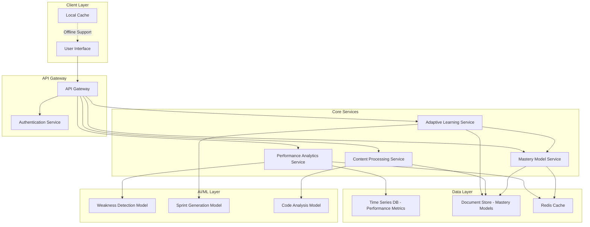

# Design Document: Topper Race

## Overview

Topper Race is architected as a modular, event-driven system that continuously analyzes user performance, adapts learning strategies, and generates personalized improvement cycles. The system is built around three core subsystems:

1. **Performance Analytics Engine**: Captures, processes, and analyzes user activity data in real time
2. **Adaptive Learning Engine**: Generates personalized mastery sprints, exercises, and recommendations based on detected weaknesses
3. **Content Processing Engine**: Analyzes codebases, generates architecture summaries, and creates comprehension exercises

The architecture emphasizes:
- Real-time data processing with sub-5-second analysis latency
- Extensible plugin architecture for different content types (student materials, codebases, etc.)
- Privacy-first design with local processing options for sensitive data
- Event-driven communication between components for scalability

## Architecture

### High-Level Architecture



### Component Interaction Flow

**Performance Tracking Flow:**
1. User completes activity → UI sends event to Performance Analytics Service
2. Performance Analytics Service records metrics to Time Series DB
3. Performance Analytics Service triggers Weakness Detection Model
4. Weakness Detection Model analyzes recent performance data
5. If weaknesses detected → Event published to Adaptive Learning Service
6. Mastery Model Service updated with latest performance data

**Mastery Sprint Generation Flow:**
1. Adaptive Learning Service receives weakness detection event
2. Service queries Mastery Model Service for user context
3. Sprint Generation Model creates personalized sprint plan
4. Sprint plan stored in Document Store
5. User notified of new sprint availability

**Codebase Analysis Flow:**
1. Developer uploads codebase → Content Processing Service
2. Code Analysis Model generates architecture summary
3. Content Processing Service creates comprehension exercises
4. Results stored in Document Store and cached
5. User receives architecture summary and exercises

## Components and Interfaces

### 1. Performance Analytics Service

**Responsibilities:**
- Record user activity and performance metrics
- Calculate aggregate statistics and trends
- Trigger weakness detection analysis
- Provide performance data for visualization

**Key Interfaces:**

```typescript
interface PerformanceAnalyticsService {
  // Record a completed activity
  recordActivity(activity: ActivityRecord): Promise<void>
  
  // Retrieve performance metrics for a user
  getMetrics(userId: string, timeRange: TimeRange, filters?: MetricFilters): Promise<PerformanceMetrics>
  
  // Get performance trends over time
  getTrends(userId: string, metricType: MetricType, timeRange: TimeRange): Promise<TrendData>
  
  // Trigger weakness analysis
  analyzeWeaknesses(userId: string): Promise<WeaknessReport>
}

interface ActivityRecord {
  userId: string
  activityId: string
  activityType: 'drill' | 'sprint' | 'exercise' | 'codebase_analysis'
  timestamp: Date
  metrics: {
    speed: number        // Time taken in seconds
    accuracy: number     // Percentage correct (0-100)
    completionRate: number  // Percentage completed (0-100)
  }
  context: {
    topic?: string
    difficulty?: number
    contentType?: string
  }
}

interface PerformanceMetrics {
  userId: string
  timeRange: TimeRange
  aggregates: {
    averageSpeed: number
    averageAccuracy: number
    totalActivities: number
    topicsStudied: number
  }
  byTopic: Map<string, TopicMetrics>
  retentionRates: {
    day1: number
    day7: number
    day30: number
  }
}
```

### 2. Adaptive Learning Service

**Responsibilities:**
- Generate personalized mastery sprints
- Create targeted exercises and drills
- Adapt difficulty based on performance
- Schedule spaced repetition for active recall

**Key Interfaces:**

```typescript
interface AdaptiveLearningService {
  // Generate a mastery sprint for identified weaknesses
  generateMasterySprint(userId: string, weaknesses: Weakness[]): Promise<MasterySprint>
  
  // Create active recall drills with spaced repetition
  generateRecallDrills(userId: string, topic: string): Promise<RecallDrill[]>
  
  // Evaluate sprint completion and update mastery model
  evaluateSprint(userId: string, sprintId: string, results: SprintResults): Promise<SprintEvaluation>
  
  // Transform user goal into structured sprint plan
  decomposeGoal(userId: string, goal: string): Promise<SprintPlan>
}

interface MasterySprint {
  sprintId: string
  userId: string
  targetWeaknesses: Weakness[]
  objectives: string[]
  exercises: Exercise[]
  duration: number  // Minutes
  successCriteria: {
    targetAccuracy: number
    targetSpeed: number
    minimumCompletion: number
  }
  createdAt: Date
  expiresAt: Date
}

interface Exercise {
  exerciseId: string
  type: 'multiple_choice' | 'short_answer' | 'problem_solving' | 'code_challenge'
  topic: string
  difficulty: number  // 1-10 scale
  content: ExerciseContent
  estimatedTime: number  // Seconds
}
```

### 3. Content Processing Service

**Responsibilities:**
- Analyze codebase structure and generate architecture summaries
- Create code comprehension exercises
- Extract key concepts from learning materials
- Generate practice problems from content

**Key Interfaces:**

```typescript
interface ContentProcessingService {
  // Analyze codebase and generate architecture summary
  analyzeCodebase(codebase: CodebaseInput): Promise<ArchitectureSummary>
  
  // Generate comprehension exercises from codebase
  generateCodeExercises(codebase: CodebaseInput, focus?: string[]): Promise<Exercise[]>
  
  // Extract concepts from learning materials
  extractConcepts(content: string, contentType: string): Promise<Concept[]>
  
  // Generate practice problems from content
  generatePracticeProblems(concepts: Concept[], difficulty: number): Promise<Exercise[]>
}

interface ArchitectureSummary {
  codebaseId: string
  overview: string
  components: Component[]
  dependencies: Dependency[]
  entryPoints: EntryPoint[]
  dataFlow: DataFlowDiagram
  keyPatterns: string[]
  complexity: {
    cyclomaticComplexity: number
    maintainabilityIndex: number
    linesOfCode: number
  }
}

interface Component {
  name: string
  type: 'module' | 'class' | 'function' | 'service'
  purpose: string
  interfaces: string[]
  dependencies: string[]
  location: string
}
```

### 4. Mastery Model Service

**Responsibilities:**
- Maintain personalized user mastery models
- Track strengths, weaknesses, and learning patterns
- Calculate learning velocity and progress
- Provide context for adaptive recommendations

**Key Interfaces:**

```typescript
interface MasteryModelService {
  // Get complete mastery model for a user
  getMasteryModel(userId: string): Promise<MasteryModel>
  
  // Update mastery model with new performance data
  updateModel(userId: string, activityData: ActivityRecord): Promise<void>
  
  // Get current strengths and weaknesses
  getStrengthsAndWeaknesses(userId: string): Promise<StrengthWeaknessReport>
  
  // Calculate learning velocity for topics
  getLearningVelocity(userId: string, topics?: string[]): Promise<VelocityReport>
}

interface MasteryModel {
  userId: string
  lastUpdated: Date
  strengths: TopicMastery[]
  weaknesses: TopicMastery[]
  learningPatterns: {
    optimalSessionDuration: number  // Minutes
    peakPerformanceTime: string     // Time of day
    preferredContentTypes: string[]
    averageImprovementRate: number
  }
  performanceHistory: PerformanceSnapshot[]
  totalActivitiesCompleted: number
  accountCreatedAt: Date
}

interface TopicMastery {
  topic: string
  masteryLevel: number  // 0-100 scale
  confidence: number    // Statistical confidence in assessment
  lastPracticed: Date
  practiceCount: number
  averageAccuracy: number
  averageSpeed: number
  retentionRate: number
  trend: 'improving' | 'stable' | 'declining'
}
```

### 5. Weakness Detection Model

**Responsibilities:**
- Analyze performance data to identify weaknesses
- Rank weaknesses by severity and impact
- Detect performance degradation on mastered topics
- Identify patterns in errors and struggles

**Algorithm Overview:**

The weakness detection model uses a multi-factor scoring system:

1. **Accuracy Score**: Topics with accuracy < 70% flagged as weak
2. **Speed Score**: Topics with speed > 1.5x user average flagged as weak
3. **Retention Score**: Topics with 7-day recall < 60% flagged as weak
4. **Trend Analysis**: Topics showing declining performance over last 10 attempts
5. **Impact Score**: Weakness severity weighted by topic importance and frequency

**Weakness Severity Calculation:**

```
severity = (
  0.4 * (1 - normalized_accuracy) +
  0.3 * (1 - normalized_retention) +
  0.2 * normalized_speed_deficit +
  0.1 * trend_factor
) * impact_multiplier

where:
  normalized_accuracy = current_accuracy / target_accuracy
  normalized_retention = retention_rate / target_retention
  normalized_speed_deficit = (user_speed - topic_speed) / user_speed
  trend_factor = 1.0 if declining, 0.5 if stable, 0.0 if improving
  impact_multiplier = topic_frequency * topic_importance
```

### 6. Sprint Generation Model

**Responsibilities:**
- Create personalized mastery sprint plans
- Select appropriate exercises based on weakness type
- Determine optimal sprint duration and difficulty progression
- Define measurable success criteria

**Sprint Generation Algorithm:**

1. **Input Analysis**: Receive weakness report and user mastery model
2. **Exercise Selection**: 
   - For accuracy weaknesses: Focus on concept reinforcement and varied examples
   - For speed weaknesses: Include timed drills with progressive difficulty
   - For retention weaknesses: Implement spaced repetition schedule
3. **Duration Calculation**: Base duration on weakness severity and user's typical session length
4. **Success Criteria Definition**: Set targets based on user's historical improvement rates
5. **Exercise Sequencing**: Order exercises from foundational to advanced

**Exercise Count Formula:**

```
exercise_count = min(20, max(5, 
  base_count + severity_bonus + topic_complexity_factor
))

where:
  base_count = 8
  severity_bonus = floor(weakness_severity * 10)
  topic_complexity_factor = topic_difficulty_rating
```

## Data Models

### Performance Metrics (Time Series)

```typescript
interface PerformanceDataPoint {
  userId: string
  timestamp: Date
  activityId: string
  activityType: string
  topic: string
  metrics: {
    speed: number
    accuracy: number
    completionRate: number
  }
  context: Record<string, any>
}

// Indexed by: userId, timestamp, topic
// Retention: 2 years
// Aggregation: Pre-computed hourly, daily, weekly rollups
```

### Mastery Model (Document Store)

```typescript
interface MasteryModelDocument {
  _id: string  // userId
  version: number
  lastUpdated: Date
  profile: {
    strengths: TopicMastery[]
    weaknesses: TopicMastery[]
    learningPatterns: LearningPatterns
  }
  history: {
    snapshots: PerformanceSnapshot[]  // Weekly snapshots
    milestones: Milestone[]
  }
  preferences: {
    notificationSettings: NotificationPreferences
    privacySettings: PrivacySettings
  }
}

// Indexed by: _id (userId)
// Versioned for conflict resolution
```

### Sprint Data (Document Store)

```typescript
interface SprintDocument {
  _id: string  // sprintId
  userId: string
  status: 'active' | 'completed' | 'expired' | 'abandoned'
  createdAt: Date
  startedAt?: Date
  completedAt?: Date
  targetWeaknesses: Weakness[]
  exercises: Exercise[]
  results?: {
    exercisesCompleted: number
    averageAccuracy: number
    averageSpeed: number
    successCriteriaMet: boolean
  }
  evaluation?: SprintEvaluation
}

// Indexed by: userId, status, createdAt
```

### Codebase Analysis (Document Store)

```typescript
interface CodebaseAnalysisDocument {
  _id: string  // codebaseId
  userId: string
  name: string
  uploadedAt: Date
  summary: ArchitectureSummary
  exercises: Exercise[]
  metadata: {
    language: string
    framework?: string
    size: number  // Lines of code
    fileCount: number
  }
}

// Indexed by: userId, uploadedAt
```

### Cache Layer (Redis)

```typescript
// Cache keys and TTL
interface CacheStrategy {
  // User mastery model - 5 minutes
  'mastery:${userId}': MasteryModel
  
  // Recent performance metrics - 2 minutes
  'metrics:${userId}:recent': PerformanceMetrics
  
  // Active sprint - 10 minutes
  'sprint:${sprintId}': SprintDocument
  
  // Weakness analysis - 5 minutes
  'weakness:${userId}': WeaknessReport
}
```


## Correctness Properties

*A property is a characteristic or behavior that should hold true across all valid executions of a system—essentially, a formal statement about what the system should do. Properties serve as the bridge between human-readable specifications and machine-verifiable correctness guarantees.*

### Property 1: Complete Performance Data Capture

*For any* user activity completion event, recording the activity should result in stored data that includes all required metrics (speed, accuracy, completion rate), timestamp, activity context, and user identification.

**Validates: Requirements 1.1, 1.2**

### Property 2: Performance Retrieval Organization

*For any* user with recorded performance data, retrieving metrics with time range and filter parameters should return data correctly organized by the specified time period and activity type, with no data outside the requested range.

**Validates: Requirements 1.3**

### Property 3: Aggregate Metric Calculation Correctness

*For any* set of performance records for a user, calculated aggregate metrics (average speed, average accuracy, total activities) should match manual calculation of the same aggregates from the raw data.

**Validates: Requirements 1.4**

### Property 4: Retention Interval Accuracy

*For any* set of recall activities with known timestamps, calculated retention rates at 1-day, 7-day, and 30-day intervals should correctly reflect recall accuracy at those specific time windows.

**Validates: Requirements 1.5**

### Property 5: Weakness Detection Threshold Compliance

*For any* user performance data, the weakness detection algorithm should identify all and only those topics where accuracy < 70%, or speed > 1.5x user average, or 7-day retention < 60%.

**Validates: Requirements 2.1, 2.2, 2.3**

### Property 6: Weakness Ranking Correctness

*For any* set of identified weaknesses with calculated impact scores, the ranked list should be ordered by descending impact score with no inversions.

**Validates: Requirements 2.4**

### Property 7: Sprint Structure Completeness

*For any* generated mastery sprint, the sprint object should contain all required fields: learning objectives, time duration, success criteria (with numeric targets), and a non-empty list of exercises.

**Validates: Requirements 3.1, 3.4**

### Property 8: Sprint Parameter Constraints

*For any* generated mastery sprint, the exercise count should be between 5 and 20 inclusive, and the duration should be between 15 and 120 minutes inclusive.

**Validates: Requirements 3.2, 3.3**

### Property 9: Sprint Evaluation and Model Update

*For any* completed mastery sprint with results, evaluating the sprint should produce an evaluation comparing results to success criteria, and the user's mastery model should reflect updated performance data.

**Validates: Requirements 3.5**

### Property 10: Revision Content Prioritization

*For any* set of weaknesses with different severity scores and assessment dates, generated revision materials should be ordered such that higher severity weaknesses and those with earlier assessment dates appear first.

**Validates: Requirements 4.1**

### Property 11: Spaced Repetition Interval Calculation

*For any* recall drill with previous performance history, the calculated next repetition interval should increase with higher recall accuracy and decrease with lower recall accuracy, following spaced repetition principles.

**Validates: Requirements 4.2, 4.3**

### Property 12: Multi-Format Exercise Support

*For any* exercise of type multiple_choice, short_answer, or problem_solving, the system should successfully create, store, and retrieve the exercise with format-specific content preserved.

**Validates: Requirements 4.4**

### Property 13: Automatic Drill Scheduling on Low Retention

*For any* topic with retention rate below 60%, the system should automatically create and schedule active recall drills for that topic.

**Validates: Requirements 4.5**

### Property 14: Architecture Summary Completeness

*For any* analyzed codebase, the generated architecture summary should include component structure, dependencies, entry points, and data flow information.

**Validates: Requirements 5.1, 5.2**

### Property 15: Workflow Inefficiency Detection

*For any* developer workflow data containing context switches, debugging sessions, and task completions, the analysis should identify and quantify inefficiencies in each category.

**Validates: Requirements 5.3**

### Property 16: Skill Drill Recommendation Relevance

*For any* identified workflow inefficiency, the recommended skill drills should target the specific inefficiency type (e.g., debugging drills for high debugging time ratio).

**Validates: Requirements 5.4**

### Property 17: Code Exercise Generation

*For any* analyzed codebase with identified components, the system should generate comprehension exercises that reference actual components, dependencies, or patterns from the codebase.

**Validates: Requirements 5.5**

### Property 18: Mastery Model Completeness and Accuracy

*For any* user with recorded activities, the mastery model should contain complete performance history, and current strength/weakness assessments should accurately reflect the performance data.

**Validates: Requirements 6.1, 6.2**

### Property 19: Rolling Window Assessment Update

*For any* mastery model update with performance data spanning more than 30 days, the updated strength/weakness assessment should only consider data from the most recent 30 days.

**Validates: Requirements 6.3**

### Property 20: Learning Velocity Calculation

*For any* topic with multiple performance records over time, the calculated learning velocity should reflect the rate of improvement (positive for improving, negative for declining, zero for stable).

**Validates: Requirements 6.4**

### Property 21: Personalized Recommendation Adaptation

*For any* two users with different mastery models (different skill levels or learning patterns), generated recommendations for the same topic should differ in difficulty, pacing, or content selection.

**Validates: Requirements 6.5**

### Property 22: Activity Feedback Completeness

*For any* completed activity, the generated feedback should include accuracy score, speed measurement, and comparison to the user's previous attempts on similar activities.

**Validates: Requirements 7.1**

### Property 23: Improvement Recognition and Adaptation

*For any* activity on a previously weak topic where performance exceeds the weakness threshold, the system should acknowledge the improvement and adjust future recommendations to reduce focus on that topic.

**Validates: Requirements 7.2**

### Property 24: Decline Detection and Response

*For any* previously mastered topic (accuracy > 80%) where recent performance drops below 70%, the system should flag the topic and schedule reinforcement exercises.

**Validates: Requirements 7.3**

### Property 25: Weekly Summary Generation

*For any* user with activity data spanning at least 7 days, the generated weekly summary should identify improvements (topics with increasing accuracy), persistent weaknesses (topics consistently below threshold), and recommended focus areas.

**Validates: Requirements 7.4**

### Property 26: Success Celebration and Progression

*For any* mastery sprint where results meet or exceed all success criteria, the feedback should include achievement acknowledgment and suggestions for next-level challenges on related topics.

**Validates: Requirements 7.5**

### Property 27: Goal Decomposition Specificity

*For any* user-provided goal, the decomposed sub-objectives should each be specific (reference concrete skills or knowledge), measurable (include quantifiable criteria), and collectively cover the original goal.

**Validates: Requirements 8.1, 8.2**

### Property 28: Prerequisite-Based Sequencing

*For any* set of sub-objectives with defined prerequisite relationships, the generated sequence should respect all prerequisites (no sub-objective appears before its prerequisites).

**Validates: Requirements 8.3**

### Property 29: Personalized Time Estimation

*For any* sub-objective and two users with different mastery levels, the estimated time requirement should be lower for the user with higher mastery in related topics.

**Validates: Requirements 8.4**

### Property 30: Sub-Objective Success Metrics

*For any* generated sprint plan, every sub-objective should have at least one defined success metric with a numeric target or clear completion criterion.

**Validates: Requirements 8.5**

### Property 31: Multi-Modal Content Handling

*For any* content of type text, problem-solving, or conceptual knowledge, the system should successfully process, store, and generate appropriate exercises for that content type.

**Validates: Requirements 9.1, 9.2, 9.3**

### Property 32: Content Type Metric Segregation

*For any* user with activities across multiple content types, retrieved performance metrics should be separable by content type with no cross-contamination.

**Validates: Requirements 9.4**

### Property 33: Exercise Context Matching

*For any* learning activity with a specific content type, generated follow-up exercises should match the original content type.

**Validates: Requirements 9.5**

### Property 34: Trend Data Calculation

*For any* user performance data over a time range, calculated trend data for speed, accuracy, retention, and productivity should correctly represent the progression of each metric over the specified period.

**Validates: Requirements 10.1**

### Property 35: Significant Change Detection

*For any* performance data with changes exceeding 20% from previous averages, the visualization should highlight these changes and provide contextual explanations.

**Validates: Requirements 10.2**

### Property 36: Comparative Analytics Accuracy

*For any* current performance metric, comparative analytics should correctly calculate and display the difference from personal best and historical average.

**Validates: Requirements 10.3**

### Property 37: Weakness Visualization Structure

*For any* set of identified weaknesses, the visualization should display them in priority order with severity indicators and at least one recommended action per weakness.

**Validates: Requirements 10.4**

### Property 38: Pattern Insight Generation

*For any* user with sufficient activity history (at least 30 activities), generated insights should identify at least one pattern related to optimal learning times, effective practice durations, or high-impact activities.

**Validates: Requirements 10.5**

### Property 39: Data Persistence Round-Trip

*For any* mastery model update or performance data record, persisting the data and then retrieving it should produce an equivalent object with all fields preserved.

**Validates: Requirements 11.2, 11.3**

### Property 40: Schema Validation Enforcement

*For any* data record (valid or invalid), the validation process should accept all records conforming to the defined schema and reject all records that violate the schema.

**Validates: Requirements 11.4**

### Property 41: Offline Queue and Retry

*For any* data update operation that fails due to connectivity, the system should queue the change locally, and when connectivity is restored, successfully synchronize the queued changes.

**Validates: Requirements 11.5**

### Property 42: Complete Data Deletion

*For any* user data deletion request, after processing, no performance data, mastery model data, or activity history for that user should remain in the system.

**Validates: Requirements 12.3**

### Property 43: Consent-Based Data Sharing

*For any* user without explicit data sharing consent, no performance data should be transmitted to third-party services or endpoints.

**Validates: Requirements 12.4**

## Error Handling

### Error Categories

**1. Input Validation Errors**
- Invalid activity records (missing required fields, out-of-range values)
- Malformed codebase uploads (unsupported formats, corrupted files)
- Invalid time ranges or filter parameters

**Handling Strategy:**
- Validate all inputs at API boundaries
- Return descriptive error messages with field-level details
- Log validation failures for monitoring
- Never persist invalid data

**2. Data Processing Errors**
- Weakness detection failures (insufficient data, calculation errors)
- Sprint generation failures (no suitable exercises, constraint conflicts)
- Codebase analysis failures (parsing errors, unsupported languages)

**Handling Strategy:**
- Implement fallback strategies (e.g., use default exercises if generation fails)
- Log detailed error context for debugging
- Return partial results when possible with warnings
- Notify users of processing limitations

**3. Storage and Persistence Errors**
- Database connection failures
- Write operation timeouts
- Data corruption or schema violations

**Handling Strategy:**
- Implement retry logic with exponential backoff
- Queue operations locally when remote storage unavailable
- Validate data integrity before and after storage operations
- Provide user feedback on sync status

**4. External Service Errors**
- AI model API failures or timeouts
- Code analysis service unavailability
- Authentication service errors

**Handling Strategy:**
- Implement circuit breaker pattern to prevent cascade failures
- Cache results when possible to reduce dependency
- Provide degraded functionality when services unavailable
- Set reasonable timeouts and handle gracefully

### Error Response Format

```typescript
interface ErrorResponse {
  error: {
    code: string          // Machine-readable error code
    message: string       // Human-readable error message
    details?: any         // Additional context (field errors, etc.)
    timestamp: Date
    requestId: string     // For support and debugging
  }
}

// Example error codes:
// - INVALID_INPUT: Input validation failed
// - INSUFFICIENT_DATA: Not enough data for analysis
// - PROCESSING_FAILED: Internal processing error
// - STORAGE_ERROR: Database or persistence error
// - SERVICE_UNAVAILABLE: External service unavailable
```

### Graceful Degradation

When components fail, the system should degrade gracefully:

1. **Performance Analytics Unavailable**: Use cached metrics, disable real-time analysis
2. **Weakness Detection Unavailable**: Allow manual topic selection for practice
3. **Sprint Generation Unavailable**: Provide pre-generated exercise templates
4. **Code Analysis Unavailable**: Allow manual architecture documentation
5. **Mastery Model Unavailable**: Use session-local performance tracking

## Testing Strategy

### Dual Testing Approach

Topper Race requires both unit testing and property-based testing for comprehensive coverage:

**Unit Tests** focus on:
- Specific examples demonstrating correct behavior
- Edge cases (empty data sets, boundary values, extreme inputs)
- Error conditions and exception handling
- Integration points between components
- Mock external dependencies (AI models, databases)

**Property-Based Tests** focus on:
- Universal properties that hold across all valid inputs
- Randomized input generation to discover edge cases
- Invariants that must be maintained (e.g., data integrity, constraint satisfaction)
- Round-trip properties (serialize/deserialize, store/retrieve)
- Metamorphic properties (relationships between inputs and outputs)

Both approaches are complementary and necessary. Unit tests catch concrete bugs and verify specific scenarios, while property tests verify general correctness across the input space.

### Property-Based Testing Configuration

**Framework Selection:**
- **TypeScript/JavaScript**: fast-check
- **Python**: Hypothesis
- **Java**: jqwik
- **Go**: gopter

**Test Configuration:**
- Minimum 100 iterations per property test (due to randomization)
- Configurable seed for reproducibility
- Shrinking enabled to find minimal failing examples
- Timeout: 30 seconds per property test

**Property Test Tagging:**

Each property-based test must reference its design document property using this format:

```typescript
// Feature: topper-race, Property 1: Complete Performance Data Capture
test('property: complete performance data capture', () => {
  fc.assert(
    fc.property(
      activityGenerator(),
      (activity) => {
        const stored = recordActivity(activity);
        return hasAllRequiredFields(stored) &&
               stored.metrics.speed !== undefined &&
               stored.metrics.accuracy !== undefined &&
               stored.timestamp !== undefined;
      }
    ),
    { numRuns: 100 }
  );
});
```

### Test Organization

```
tests/
├── unit/
│   ├── performance-analytics/
│   │   ├── recording.test.ts
│   │   ├── aggregation.test.ts
│   │   └── retrieval.test.ts
│   ├── adaptive-learning/
│   │   ├── sprint-generation.test.ts
│   │   ├── exercise-selection.test.ts
│   │   └── difficulty-adaptation.test.ts
│   ├── content-processing/
│   │   ├── codebase-analysis.test.ts
│   │   └── exercise-generation.test.ts
│   └── mastery-model/
│       ├── model-updates.test.ts
│       └── strength-weakness.test.ts
├── property/
│   ├── performance-tracking.property.test.ts
│   ├── weakness-detection.property.test.ts
│   ├── sprint-generation.property.test.ts
│   ├── mastery-model.property.test.ts
│   └── data-persistence.property.test.ts
├── integration/
│   ├── end-to-end-flows.test.ts
│   ├── api-contracts.test.ts
│   └── database-integration.test.ts
└── generators/
    ├── activity-generators.ts
    ├── performance-generators.ts
    ├── codebase-generators.ts
    └── user-generators.ts
```

### Key Testing Scenarios

**Performance Tracking:**
- Record activities with various metric combinations
- Handle missing or invalid metrics gracefully
- Aggregate metrics correctly across time periods
- Calculate retention rates with sparse data

**Weakness Detection:**
- Identify weaknesses across all threshold types
- Handle users with no weaknesses (all strong performance)
- Handle users with all weaknesses (struggling across board)
- Correctly rank weaknesses by impact

**Sprint Generation:**
- Generate sprints for single and multiple weaknesses
- Respect exercise count and duration constraints
- Create appropriate success criteria based on current performance
- Handle cases where insufficient exercises available

**Mastery Model:**
- Update model incrementally with new data
- Maintain 30-day rolling window correctly
- Calculate learning velocity for improving and declining topics
- Handle model initialization for new users

**Data Persistence:**
- Round-trip all data types (activities, models, sprints)
- Handle concurrent updates to mastery models
- Recover from storage failures with queuing
- Validate schema compliance on all writes

### Performance Testing

While not part of unit/property testing, the following performance benchmarks should be validated:

- Activity recording: < 100ms p95
- Weakness analysis: < 5 seconds p95
- Sprint generation: < 3 seconds p95
- Mastery model update: < 200ms p95
- Performance metric retrieval: < 500ms p95
- Codebase analysis: < 30 seconds for 10k LOC

### Test Data Generators

Property-based tests require generators for domain objects:

```typescript
// Example generators for fast-check

const activityRecordGenerator = () => fc.record({
  userId: fc.uuid(),
  activityId: fc.uuid(),
  activityType: fc.constantFrom('drill', 'sprint', 'exercise', 'codebase_analysis'),
  timestamp: fc.date(),
  metrics: fc.record({
    speed: fc.integer({ min: 1, max: 3600 }),
    accuracy: fc.integer({ min: 0, max: 100 }),
    completionRate: fc.integer({ min: 0, max: 100 })
  }),
  context: fc.record({
    topic: fc.option(fc.string(), { nil: undefined }),
    difficulty: fc.option(fc.integer({ min: 1, max: 10 }), { nil: undefined })
  })
});

const weaknessGenerator = () => fc.record({
  topic: fc.string({ minLength: 1 }),
  severity: fc.double({ min: 0, max: 1 }),
  type: fc.constantFrom('accuracy', 'speed', 'retention'),
  impactScore: fc.double({ min: 0, max: 100 })
});

const masteryModelGenerator = () => fc.record({
  userId: fc.uuid(),
  strengths: fc.array(topicMasteryGenerator(), { maxLength: 10 }),
  weaknesses: fc.array(topicMasteryGenerator(), { maxLength: 10 }),
  learningPatterns: fc.record({
    optimalSessionDuration: fc.integer({ min: 15, max: 120 }),
    peakPerformanceTime: fc.constantFrom('morning', 'afternoon', 'evening'),
    averageImprovementRate: fc.double({ min: 0, max: 1 })
  })
});
```

These generators should:
- Produce valid domain objects
- Cover edge cases (empty arrays, boundary values)
- Generate realistic data distributions
- Be composable for complex scenarios
